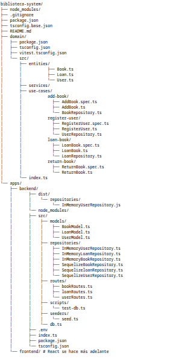

# IT-Teca: `biblioteca-system`



## Arquitectura: Clean Architecture

El proyecto está estructurado siguiendo los principios de **Clean Architecture**, con una clara separación de responsabilidades en capas :

| Capa                  | Ubicación                                            | Tecnologías / Descripción                                                  |
|-----------------------|------------------------------------------------------|-----------------------------------------------------------------------------|
| **Entidades**         | `domain/src/entities/`                               | Modelos de dominio puros (`User`, `Book`, `Loan`)                          |
| **Use Cases**         | `domain/src/use-cases/`                              | Lógica de negocio desacoplada por caso (`AddBook`, `LoanBook`, etc.)       |
| **Repositorios**      | `use-cases/*Repository.ts` + `apps/backend/src/repositories/` | Interfaces en el dominio, implementaciones con Sequelize y memoria         |
| **Rutas HTTP**        | `apps/backend/src/routes/`                           | Controladores construidos con **Fastify**, invocando casos de uso          |
| **Infraestructura DB**| `apps/backend/src/models/`                           | Modelos **Sequelize** conectados a **MySQL**                                |

---

## Testing: Test-Driven Development (TDD)

El proyecto aplica **TDD** en el dominio, siguiendo este flujo:

1. Se escriben pruebas con [`Vitest`](https://vitest.dev/)
2. Se implementa el mínimo código necesario
3. Se refactoriza después de que las pruebas pasen

Cada caso de uso tiene su prueba en `*.spec.ts` y su implementación asociada (`AddBook`, `RegisterUser`, etc.).

Ejecutar pruebas:

```bash
cd domain
npm run test
```

### Refleccion final
	
*Implementar esta app con Clean Architecture y TDD me permitio separar muy bien las responsabilidades, lo cual hizo que fuera fácil probar cada componente individualmente. Aunque al principio la estructura parecía compleja, una vez que todo encajó, fue mucho más mantenible y clara. Noté la importancia de escribir los tests primero: me ayudaron a descubrir errores de diseño antes de implementar. Lo más desafiante fue la coordinación entre los repositorios y los casos de uso. Aprendí que la arquitectura limpia no es solo una “moda”, sino una herramienta real para evitar caos en proyectos medianos y grandes.*


#  Arquitectura y Desarrollo

Este proyecto sigue una **arquitectura Hexagonal (o Limpia)**, utilizando **TDD (Desarrollo Guiado por Pruebas)** en ambos extremos para asegurar la **robustez** y el **mantenimiento**.


---

##  Stack Tecnológico

| Componente | Tecnología | Propósito |
|-------------|-------------|------------|
| **Backend** | Fastify, TypeScript | Servidor REST . |
| **Base de Datos** | MySQL | Almacenamiento persistente de datos. |
| **ORM** | Sequelize | Mapeo Objeto-Relacional y gestión de la BD. |
| **Frontend** | React, TypeScript, Vite | Interfaz de usuario modular. |
| **Testing** | Vitest, Storybook | Ejecución de pruebas unitarias, de integración y visuales. |

---
                           |

## Frontend

##  Enfoque TDD y Arquitectura Limpia

Se implementó el patrón de **Arquitectura Limpia (Clean Architecture)** con los siguientes principios:

- **Dominio (Core):** Contiene Entidades y Casos de Uso (Interactores) independientes de framework.  
- **Inversión de Dependencias (DIP):** El Frontend utiliza un patrón *Factory* para inyectar Repositorios, permitiendo alternar fácilmente la capa de infraestructura.

---

##  Control de Entorno (`VITE_USE_API`)

La variable de entorno `VITE_USE_API` en el **frontend** actúa como un **interruptor global** para la capa de datos:

| `VITE_USE_API` | Modo | Repositorio Utilizado | Objetivo |
|----------------|------|------------------------|-----------|
| `true` | API Real (Producción/Desarrollo) | `ApiUserRepository`, `ApiBookRepository`, etc. | Conecta a **MySQL** a través del **Backend de Fastify**. |
| `false` | Mock en Memoria (Testing/Storybook) | `InMemoryUserRepository`, `InMemoryBookRepository`, etc. | Usa datos volátiles en memoria, funciona sin el Backend. |

---

##  Estado de Pruebas

Las pruebas de la aplicación (Frontend con **Vitest/Storybook** y Backend) han pasado satisfactoriamente, validando la **lógica de negocio** y la **integración de las diferentes capas**.

---

##  Configuración del Entorno (`.env`)

Es nesesario configurar las variables de entorno para el **Backend** y el **Frontend**.
Define la conexión a la base de datos, el puerto del servidor y los orígenes CORS permitidos para desarrollo.


### Características principales de la construcción:

MySQL:
Base de datos MySQL 8.
Configuración de variables de entorno para acceso con un usuario y contraseña personalizados.
Volúmenes persistentes para los datos.

### Backend (Node.js):

Construido a partir de un Dockerfile personalizado.
Conexión a la base de datos configurada mediante variables de entorno.
Volúmenes montados para el código fuente y node_modules.

### Frontend (React/Vite):

Utiliza una construcción de multi-etapa para separar el build y la ejecución.
La aplicación está servida por Nginx para una mejor eficiencia en producción.

### Requisitos previos:

Docker y Docker Compose deben estar instalados.

**Pasos para ejecutar:**

Clonar el repositorio y navega a la raíz del proyecto.

Ejecutar

```bash
    docker-compose up --build 
```
